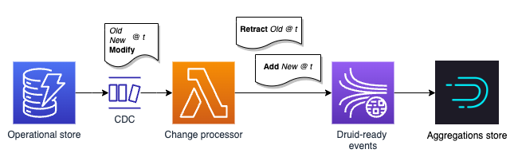

# dynamodb-druid-cdc

Example code from [Using change data capture to perform flexible aggregations with DynamoDB and Druid](https://alexjreid.dev/posts/druid-cdc/)



This repo contains a stack to support the ideas discussed in the above post. It consists of a Lambda function that processes events from a DynamoDB Streams trigger on an example table. The Lambda function converts the DynamoDB change events into events suitable for ingestion into Druid and emits them to a Kinesis Stream. You can then setup Druid to ingest this stream for delightful querying times.

The interesting bit [is here in core.cljs](src/ddbcdc/core.cljs). This video shows it in operation.

https://user-images.githubusercontent.com/1062363/184361881-c6e651ec-b70c-4bc0-9aff-8072b8049860.mp4

## Running the example locally

As a bundled version is included in `dist/` you do not need to `npm install`.

```
cd example-js-interop
node example.js
```

[example.js](example-js-interop/example.js) passes the Lambda event payload in [example.json](example-js-interop/example.json) through a test handler, emitting the results to `stdout`. 

## Building and deploying to AWS

Assuming you have Java 11, node 16, SAM CLI all setup ... and an AWS access key and secret (for a suitable acccount) configured:

```
# first time
npm install

npm run build
npm run deploy
```

You will be prompted whether you wish to go ahead with the deployment before any resources are created. Note that a single shard Kinesis Stream is created, which will have on-going costs, so delete the stack when you're finished with it.

## Using it

A DynamoDB table is created as part of the stack. After making a change to this table you will see the output appear in CloudWatch logs. The video above also shows it working in operation. Events are now being written to Kinesis for Druid to consume!

Without any modifications, `MODIFY` events will only be properly handled for the known dimensions or attributes. These values can be changed in [lambda.cljs](src/ddbcdc/lambda.cljs#L38).

## Apache Druid

It is assumed you are up and running with Druid, but if not it is easy to get going with the [quick start either locally or on an EC2 instance](https://druid.apache.org/docs/latest/tutorials/index.html). You will need a minimum of 4-8GB RAM so do not waste your time with anything smaller.

Visit the console at http://localhost:8888/ and click on Load data, then Kinesis. Follow the self explanatory prompts. All going well, Druid will consume from your Kinesis stream. 

The active IAM role for the machine that hosts Druid will need access to read from the Kinesis Stream created by this stack.

## Testing

Tests can be run using `npm test`. They are also run on every commit to this repository with [GitHub Actions](.github/workflows/ci.yaml). This workflow also demonstrates how to setup `shadow-cljs` with GitHub Actions.

## Notes

I used ClojureScript to avoid slow cold starts on Lambda. A JVM is overkill here perhaps anyway. The implementation will of course run on Clojure in the JVM with a tiny bit of effort if that is your bag. This is just an example repository. You could implement this pattern in straight JavaScript and save some time, if you wanted.

Feedback is always welcome.
